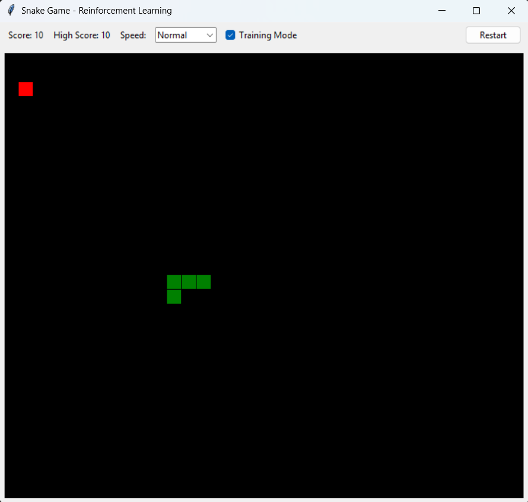

# Reinforcement Learning Snake Game 🐍

A Snake game implementation that uses Q-Learning, a reinforcement learning algorithm, to train an AI agent to play the game. The project demonstrates how machine learning can be applied to classic games.



## Features 🎮

- **Reinforcement Learning**: Implements Q-Learning algorithm for AI training
- **Dual Mode**: Play manually or watch the AI learn
- **Customizable Speed**: Adjust game speed (Slow, Normal, Fast)
- **Score Tracking**: Tracks current score and high score
- **Training Mode**: Toggle between AI training and manual play
- **Keyboard Controls**: Arrow keys for manual play
- **Persistent Learning**: Saves and loads Q-table for continuous learning

## Requirements 📋

- Python 3.x
- Required packages:
  - tkinter
  - numpy
  - pickle (built-in)

## Installation 🚀

1. Clone the repository:
```bash
git clone https://github.com/Assem-ElQersh/Reinforcement-Learning-Snake.git
cd Reinforcement-Learning-Snake
```

2. Install required packages:
```bash
pip install numpy
```

## How to Play 🎯

1. Run the game:
```bash
python "Reinforcement Learning Snake Game.py"
```

2. Game Controls:
   - **Arrow Keys**: Control snake direction (in manual mode)
   - **Space**: Restart game
   - **Training Mode**: Toggle AI learning on/off
   - **Speed Control**: Adjust game speed

## How It Works 🧠

### Q-Learning Implementation

The game uses Q-Learning, a reinforcement learning algorithm, with the following components:

1. **State Space**:
   - Snake's position relative to walls
   - Food direction
   - Distance to food
   - Danger detection

2. **Action Space**:
   - Left
   - Right
   - Up
   - Down

3. **Reward System**:
   - Eating food: +20
   - Death: -100
   - Moving closer to food: +0.5
   - Moving away from food: -0.5
   - Each step: -0.1

### Learning Parameters

```python
GAMMA = 0.9      # Discount factor
ALPHA = 0.1      # Learning rate
EPSILON = 0.5    # Initial exploration rate
EPSILON_DECAY = 0.99  # Exploration decay rate
EPSILON_MIN = 0.01    # Minimum exploration rate
```

## Project Structure 📁

```
├── Reinforcement Learning Snake Game.py  # Main game file
├── q_table.pkl                           # Saved Q-table
├── example.png                           # Example
└── README.md                             # This file
```

## Contributing 🤝

Contributions are welcome! Please feel free to submit a Pull Request.

## License 📄

This project is licensed under the MIT License - see the LICENSE file for details.

## Acknowledgments 🙏

- Inspired by classic Snake game
- Built with Python and Tkinter
- Uses Q-Learning algorithm for AI implementation

## Future Improvements 🔮

- [ ] Add different difficulty levels
- [ ] Implement different reward systems
- [ ] Add visualization of Q-values
- [ ] Support for different map layouts
- [ ] Add sound effects
- [ ] Implement different AI algorithms

## Contact 📧

For any questions or suggestions, please open an issue in the repository. 